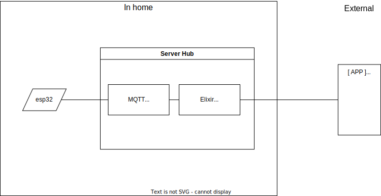

> [!CAUTION]
> A large amount of this is AI generated!!!

# Allocation View

## Elements

- DoorLock Using a esp32
  - Rust using [Embassy](https://github.com/embassy-rs/embassy)
- Server
  - MQTT Broker
  - Web Server either with elixir or some other framework
  - Database, contained within the server hub (containerized probably)
- Mobile App
  - Using Expo for easier development
    - React Native multiplatform app
  - Will use MQTT to communicate with the server
    - Maybe with some expo or RN library

## Communication

- DoorLock <-> Server: MQTT
- Mobile App <-> Server: MQTT

## Responsibilities

- DoorLock: Physical security of the door lock
- Server:
  - State machine control of the door lock
  - Database management (users and logs)
  - System security
- Mobile App: User interface and experience

## Technologies

- Server: Containerized
- DoorLock: Rust with Embassy
- Mobile App: Expo, React Native

## Trustworthiness and Security

- System verification and analysis
- Server responsible for system security
- ESP32 responsible for physical security

## Rational

The Allocation View serves as a roadmap, detailing the distribution of
responsibilities and technologies within our system architecture. It's designed
to provide a clear understanding of how each component interacts and contributes
to the overall system.

In the Elements section, we introduce the key components of our system. The
DoorLock, powered by an ESP32 and programmed with Rust and Embassy, is our
frontline defense. The Server, equipped with an MQTT Broker, Web Server, and
Database, is the brain of the operation, managing data and coordinating actions.
Lastly, the Mobile App, built with Expo and React Native, serves as the user's
gateway to control and monitor the system.

The Communication section underscores the importance of seamless interaction
between components. We've chosen MQTT as our communication protocol for its
lightweight nature and publish-subscribe model, facilitating real-time updates
between the DoorLock, Server, and Mobile App.

In the Responsibilities section, we delve into the specific roles of each
component. The DoorLock ensures the physical security of the door, the Server
manages the state of the door lock, handles database operations, and safeguards
the system, while the Mobile App enhances user interaction and experience.

The Technologies section offers a snapshot of the tools we've chosen. We've
containerized the Server for easy deployment and scalability, used Rust with
Embassy for the DoorLock for its memory safety and concurrency features, and
selected Expo with React Native for the Mobile App for its cross-platform
capabilities and ease of use.

Finally, the Trustworthiness and Security section emphasizes our commitment to
system integrity. We believe in rigorous system verification and analysis to
ensure our system performs as expected. The Server is tasked with system
security, while the ESP32 handles physical security, creating a layered defense
strategy.

In essence, the Allocation View is a comprehensive guide to our system
architecture, shedding light on its components, their communication,
responsibilities, the technologies used, and our approach to ensuring
trustworthiness and security.

> [!CAUTION]
> A large amount of this is AI generated!!!
